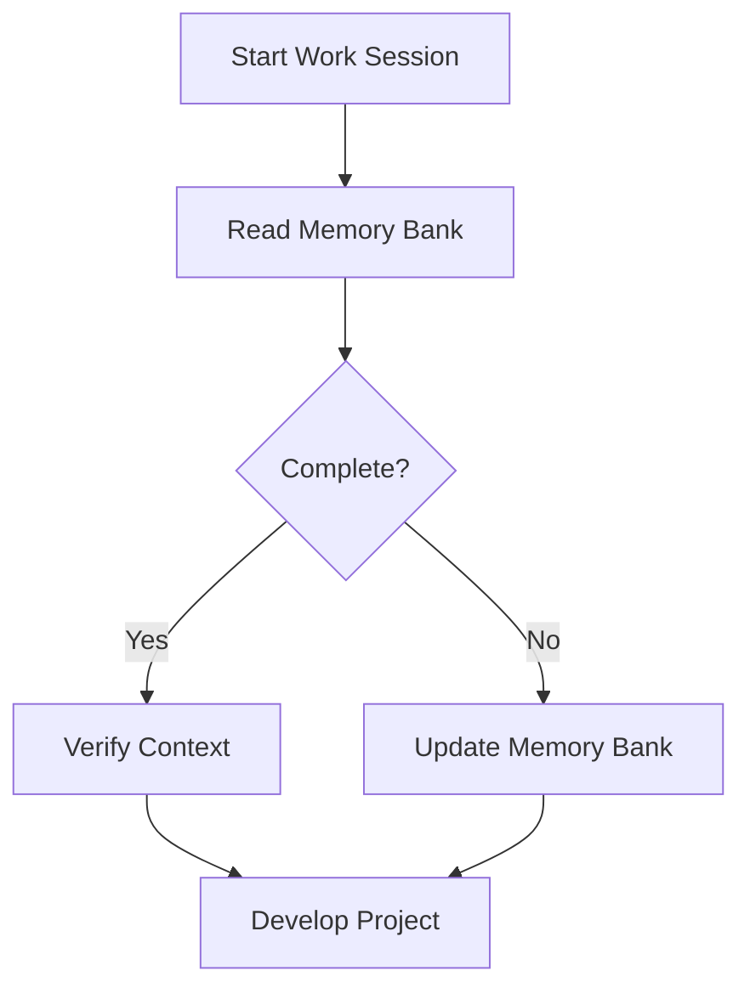
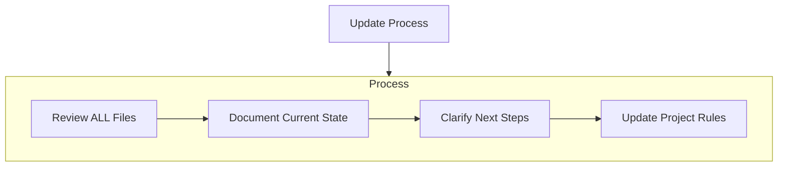

# Android-Spoof Memory Bank

## Introduction
Memory Bank is a central documentation system, designed to maintain knowledge and context for the Android-Spoof project. This system is based on Cline's Memory Bank model, created to ensure that all important project information is recorded and easily accessible, even when the development team changes or when there are time gaps between work sessions.

## Purpose
Memory Bank serves as the primary documentation source for Android-Spoof, helping to:
- Maintain continuous project knowledge
- Ensure consistency throughout development
- Provide complete context for new members
- Track progress and important decisions

## Memory Bank Structure
Memory Bank includes the following main files:

### Core Files (Required)
1. **projectbrief.md**
   - Foundation document that shapes all other files
   - Defines core requirements and goals
   - Source of truth for project scope

2. **productContext.md**
   - Why this project exists
   - Problems it solves
   - Desired user experience

3. **activeContext.md**
   - Current work focus
   - Recent changes
   - Next steps
   - Ongoing decisions and considerations

4. **systemPatterns.md**
   - System architecture
   - Key technical decisions
   - Design patterns in use
   - Component relationships

5. **techContext.md**
   - Technologies used
   - Development setup
   - Technical constraints
   - Dependencies

6. **progress.md**
   - What works
   - What's left to build
   - Current status
   - Known issues

## How to Use Memory Bank

### Memory Bank Reading Process

### Memory Bank Update Process
Memory Bank should be updated when:
1. Discovering new project patterns
2. After implementing significant changes
3. When requested with **update memory bank**
4. When context needs clarification

## Working with Memory Bank Rules
1. **Read Before Starting**: Always read Memory Bank before starting any task
2. **Update Regularly**: Update Memory Bank files after completing important tasks
3. **Prioritize Consistency**: Ensure information is consistent across Memory Bank files
4. **Reference in Source Code**: Reference Memory Bank in source code comments when appropriate

## Special Note
When receiving the command **update memory bank**, review and update all Memory Bank files, especially activeContext.md and progress.md as they track the current state of the project.

Memory Bank is a living document - it should evolve with the project and always reflect the current state of Android-Spoof. 